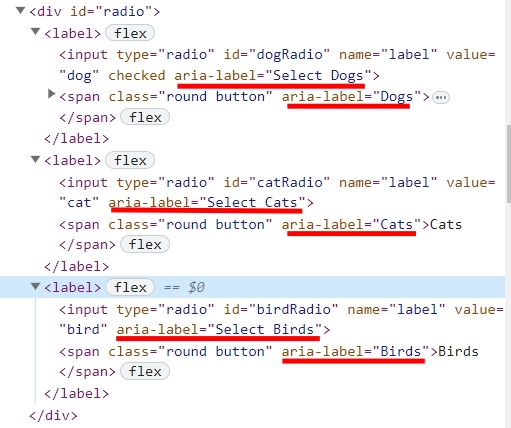

import * as React from 'react';
import { CompletedRadioGroup } from '../components/ui/radioGroup';

# Radio Group Component

**Contributed by Harrison**

A radio group is defined by giving each of radio buttons in the group the same `name`. Using radio buttons, users may select only one option from a collection of mutually incompatible options.

## Basic Radio Group Component

This HTML code is for the user to select their favorite pet. It provides three radio buttons for different pet choices: dogs, cats, and birds. Each radio button has a corresponding label that's associated using the for attribute. The form also contains a submit button.

This JavaScript code adds an event listener to the form's submit event. When the user submits the form, it captures the data using `FormData`. After looping over each form entry, the key-value pairs are then combined to create a string. This string is then displayed in the element with the id `log`. The `event.preventDefault()` prevents the default form submission behavior.

<CompletedRadioGroup />

## Usability

  
Options Should Be Comprehensive and Clearly Distinct

  Vague or misleading labels will let users be confused. Using the obvious and intuitive
  label can increase the usability. [Nielsen Norman Group](https://www.nngroup.com/articles/radio-buttons-default-selection/)

  
Always Offer a Default Selection

  The ability for users to undo and redo their actions is one of the ten UI design
  criteria. This entails allowing users to restore UI controls to their initial settings.
  This implies that radio buttons should always have precisely one choice pre-selected
  in the case of radio buttons. Choose the one that is the safest and most secure
  to avoid data loss. Checked attribute can set one option to be default.
  [Nielsen Norman Group](https://www.nngroup.com/articles/radio-buttons-default-selection/)

  
Lay Out Your Lists Vertically

  Users are more used to view the radio buttons vertically. When viewing horizontal
  radio buttons, users will encounter problems. [babich.biz](https://babich.biz/radio-buttons-ux-design/)

  
Use Label Tags as Click Targets

  Larger target area for users to tap can increase usability. Not only let them click
  the circle button but also click the label. [babich.biz](https://babich.biz/radio-buttons-ux-design/)

  
Avoid Nesting

  Nesting radio buttons can be confused for viewers. Keeping all options at the same
  level is important. [babich.biz](https://babich.biz/radio-buttons-ux-design/)

  
Use Animation or Visual Feedback

  Allow users to have post-click feedback after clicking the radio button. Don't
  let them not know that they have clicked.

## Accessibility

  
Keyboard Interaction

  By using keyboard, users can more easily navigate and select options instead of
  relying solely on mouse actions. Moreover, we ensure that our page adheres to accessibility
  guidelines and makes it easy for users with disabilities to access and use the
  radio group. Users can press `up` and `down` key to move the selected option.

  
Identify The Purpose of Radio Group

  The radio group should have a label identifying its functionality. It can increase
  the website accessibility for disabled users.
  {/*  */}

## Version

| Version | Editor          | Author          | Date       | Description |
| ------- | --------------- | --------------- | ---------- | ----------- |
| v1.0    | Hsiangwen Cheng | Hsiangwen Cheng | 22.09.2023 | version 1   |

## Radio Attributes

Here is a table describing some common attributes for the HTML radio group component.

| Attribute | Description                                                                                                                            |
| --------- | -------------------------------------------------------------------------------------------------------------------------------------- |
| Type      | It indicates the input type, It is added to create a user defined button. In this case, the input type is set as `Radio`.              |
| Name      | It indicates the name of input elements. Different radio buttons with the same name are grouped together.                              |
| Value     | It sends the value of the selected option to the server.                                                                               |
| Checked   | It is used to select an option by default if nothing is chosen by the user.                                                            |
| Required  | If any radio button in a same-named group of radio buttons has the `required` attribute, a radio button in that group must be checked. |
